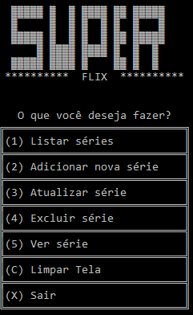

<h2>Cadastros de séries 🍿</h2>

Este é um sistema de cadastro  e atualização de séries  desenvolvido no Boot Camp **Take Blip Fullstack Developer🤖** da DIO. 

------

<h2>Como usar?</h2>

No Visual Studio abra o arquivo **cad.Series.sln** e de start na aplicação, o terminal será aberto e o sistema de cadastro estará disponível.

Também é possível acessar o executável da aplicação acessando a pasta bin e as pastas seguintes até encontrar o arquivo **cad.Series.exe**

 O código foi escrito em diferentes arquivos C#, então para abrir o código basta abrir os arquivos com extensão .cs em qualquer editor de código.

------

<h2>Como funciona o cadastro? 🎬</h2>

Após abrir o arquivo será visualizado o sistema de cadastro.

Basta digitar uma opção e seguir os passos apresentados.

1️⃣  Listar séries: Lista todas as séries cadastradas. (as séries não são salvas, logo ao fechar o programa ele volta ao estado inicial.)

2️⃣  Adicionar nova série: Abre a interface de cadastro de séries em que é possível preencher um gênero, título, ano e descrição.

3️⃣ Atualizar série: Permite alterar os dados de uma série a partir de seu ID.

4️⃣ Excluir série: Nesta alternativa não excluímos definitivamente a série, mas mostramos ela como excluída. Porém, ainda é possível acessar os dados da série cadastrada. 

5️⃣ Ver série: Mostra os detalhes da série cadastrada a partir da seleção de seu ID.

**C** Limpar tela: Apaga os resultados anteriores do terminal mostrando apenas o menu de seleção.

❌ Finaliza a aplicação.

------

## Softwares  e linguagens usados 💾

### <a href="https://visualstudio.microsoft.com/pt-br/">Visual Studio   </a>

###      <a href="https://docs.microsoft.com/pt-br/dotnet/csharp/tour-of-csharp/">C-Sharp</a>

------

## Contato

###  

